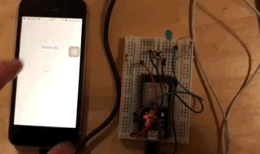

# BLE_Swift_ESP32_SampleProject
Sample project for connecting ESP32 and iOS (Swift code)

The embedded folder contains the Arduino code to be uploaded on a ESP32 compatible board/chip. 

The sample project shows a bidirectional communication over bluetooth low energy. 

